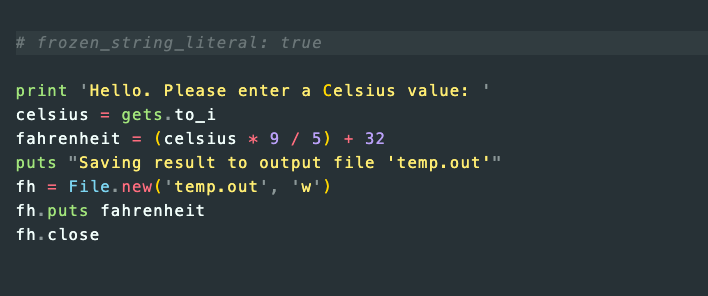

# 🌡️ Ruby - A Simple Temperature Converter

</a>

This project is a simple temperature converter (from celsius to fahrenheit or fahrenheit to celcius) using Ruby. The final build of the program include the function to read from one data file and write to a new, external file.

## 📐 Project Specifics

The converter is pretty simple and essentially reads a value from one external file, converts it in the c2fio.rb program itself and then writes it externally to another file - all with onscreen prompts/notification so the user is aware of what is going on. There are four builds of the file, which do the following:

  - **'c2fi.rb'** - Celsius to Fahrenheit (c2f) *in*. Accepts a value from an external data file ('temp.dat') to be read, converted and printed to the user on the command line.

  - **'c2fo.rb'** - Celsius to Fahrenheit *out*. Accepts a value from the user, converts the (Celsius) value to Fahrenheit and writes that value to the external 'temp.dat' file. If the file does not exist, it is created.

  - **'c2fio.rb'** - Celsius to Fahrenheit *in&out*. Reads a celsius value from and external data file ('temp.dat'), converts it and writes it to the existing 'temp.out' data file. If the file does not exist, it is created.

  - **'f2cio.rb'** - The reverse of the above 👆🏽

## 🏗️ Technologies & Languages Used

- Ruby 2.3.7p456
- Rubocop for formatting

## 🕹️ Contributions & Use

Contributions, issues and feature requests are welcome! Feel free to check [issues page](https://github.com/Rhelli/Temp_Converter/issues).

1. Fork it (https://github.com/Rhelli/Temp_Converter/fork)
2. Create your working branch (git checkout -b [choose-a-name])
3. Commit your changes (git commit -am 'what this commit will fix/add/improve')
4. Push to the branch (git push origin [chosen-name])
5. Create a new Pull Request

Additionally please feel free to modify, copy and use the code in this repository. It's all for learning purposes so have fun!

## 👨🏿‍💻 Creator

Rory Hellier - [GitHub](https://github.com/Rhelli)

## 🖐️ Show Your Support

Give a ⭐️ if you like this project!

## ⚖️ Licensing

This project is [MIT](https://github.com/Rhelli/Temp_Converter/license.txt) licensed.
